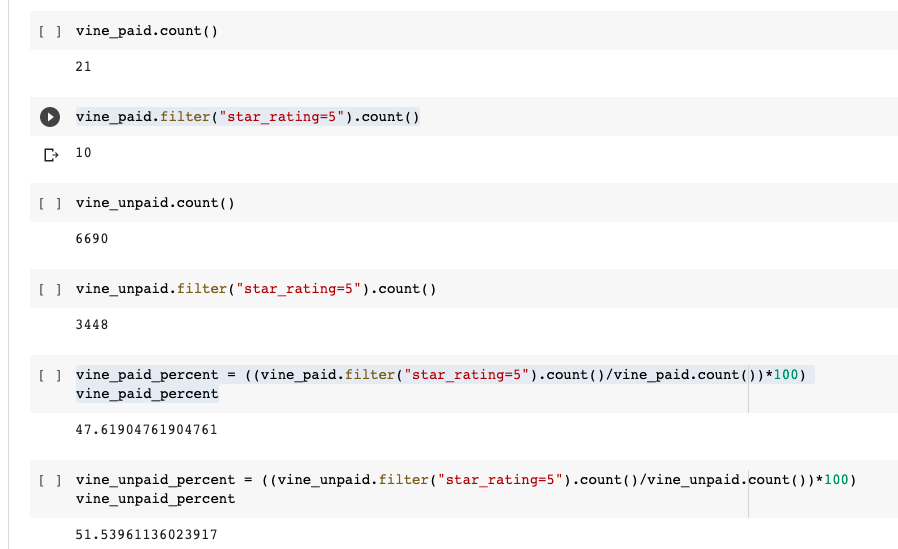

# Amazon_Vine_Analysis

## Overview: 

This analysis looks at Amazon Vine program data to determine if there is any bias toward favorable reviews from Vine member. This analysis looks at reviews for luggage. 

## Results:

  -  How many Vine reviews and non-Vine reviews were there?
      There are 21 paid Amazon Vine reviews and 6690 unpaid.
      
  - How many Vine reviews were 5 stars? How many non-Vine reviews were 5 stars?
      10 paid vine reviews have a 5 star rating. 3,448 unpaid vine reviews have 5 star ratings.
      
  - What percentage of Vine reviews were 5 stars? What percentage of non-Vine reviews were 5 stars?
      47.6% of paid vine reviews are 5 stars while 51.5% of unpaid vine reviews are 5 stars. 

## Summary:
  
Based on the analysis, there does not seem to be any positivity bias. Theere is less than a 5% difference between the 5 start ratings for paid and unpaid vine reviews. It would be helpful to look at the percentage of paid to unpaid reviews per review_id. 

 
